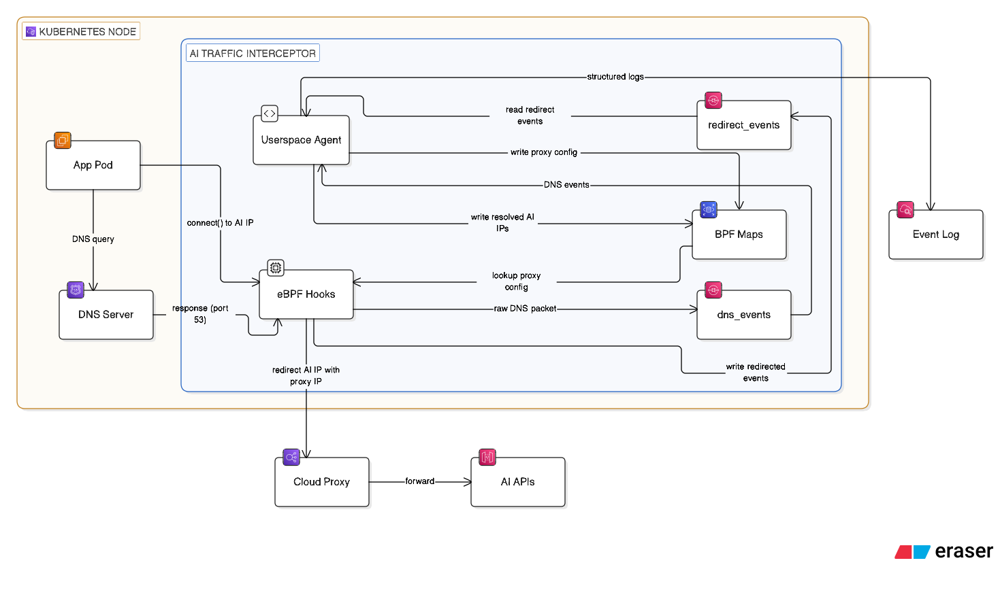

# ai-traffic-interceptor

An eBPF-based agent that transparently detects and redirects outbound AI service traffic (OpenAI, Anthropic, Gemini, etc.) through a proxy, without modifying application code or breaking TLS.

---

## Problem Statement

Organizations need visibility into and control over AI service calls made by workloads running inside Kubernetes clusters. The traffic is TLS-encrypted, so layer-7 inspection requires either full TLS termination (out of scope) or operating at the network layer: observe DNS resolutions to learn which IPs correspond to AI hostnames, then intercept TCP connections to those IPs *before the TLS handshake* and redirect them to a corporate proxy.

This project implements the second approach using eBPF. Zero application code changes, near-zero overhead on non-AI traffic.

---

## Architecture



The agent runs as a DaemonSet (one pod per node). It attaches two eBPF programs to the host:

- **TC hook** on `eth0` ingress: sniffs DNS responses and writes raw packets to the `dns_events` ring buffer
- **cgroup/connect4 hook** on the root cgroup: intercepts every `connect()` syscall before the TCP handshake

The userspace agent reads from both ring buffers. DNS events are parsed to build a map of AI-owned IPs (`ai_destinations`). Redirect events are emitted by the cgroup hook whenever a connection is rewritten, and logged by the agent.

---

## Data Flow

### DNS observation
1. App pod resolves `api.openai.com`, DNS response arrives on `eth0` ingress
2. TC hook copies the raw DNS payload into the `dns_events` ring buffer
3. Userspace agent parses the response, matches against the AI domain list
4. Resolved IPs are written into the `ai_destinations` BPF map

### Connection intercept
1. Service pod calls `connect()` to a resolved AI IP
2. cgroup/connect4 hook fires before the TCP handshake
3. Hook looks up the destination IP in `ai_destinations`
4. If matched: reads proxy address from `proxy_config` map, rewrites `ctx->user_ip4` and `ctx->user_port`, emits a `redirect_event` to the ring buffer
5. App's TCP connection lands on the corporate proxy instead. TLS ClientHello is intact, proxy reads SNI to know the original destination
6. Userspace agent reads `redirect_events` and logs the redirect with PID, process name, original host/IP, and proxy destination

---

## Design Decisions

### TC hook for DNS (not syscall tracepoints)

A TC program attached to `eth0` ingress captures DNS responses at the network layer before any process handles them. This works regardless of which syscall (`recvfrom`, `recvmsg`, etc.) the resolver uses, and provides visibility across all pods on the node from a single attachment point. The tradeoff is that TC requires `CAP_NET_ADMIN` whereas syscall tracepoints only need `CAP_BPF`.

### cgroup/connect4 for redirect (not TC egress rewrite)

`cgroup/connect4` fires before the TCP three-way handshake. The socket hasn't sent a single byte yet. Rewriting the destination at this point means the TLS ClientHello already targets the proxy, so no packet surgery on live flows is needed. TC egress rewriting would require intercepting and modifying TCP SYN packets in-flight, which is more fragile and harder to get right across connection retries.

### CO-RE with bundled vmlinux.h

The eBPF programs are compiled against a `vmlinux.h` generated from BTF, and the resulting bytecode for both `amd64` and `arm64` is embedded directly in the Go binary by `bpf2go`. No kernel headers, clang, or libbpf are needed on the target node. The binary is fully self-contained.

### Ring buffers for kernel to userspace events

Both `dns_events` and `redirect_events` use `BPF_MAP_TYPE_RINGBUF` rather than perf buffers. Ring buffers are shared across CPUs (lower memory footprint), support variable-length records, and provide stronger ordering guarantees. The userspace agent reads from both asynchronously without blocking the eBPF programs.

---

## Components

| Component | Location | Role |
|---|---|---|
| TC hook | `bpf/ai_interceptor.c` | Captures DNS responses on eth0 ingress |
| cgroup/connect4 hook | `bpf/ai_interceptor.c` | Intercepts and rewrites outbound connections |
| BPF maps | `bpf/maps.h` | Shared state between kernel and userspace |
| DNS service | `src/internal/bpf/dns/service.go` | Parses DNS events, writes resolved IPs to map |
| BPF manager | `src/internal/bpf/hooks.go` | Loads eBPF objects, attaches hooks, seeds proxy config |
| Ring buffer readers | `src/internal/bpf/reader.go` | Reads dns_events and redirect_events async |
| Config | `src/internal/config/config.go` | Env-var config via cleanenv |
| Logger | `src/internal/logger/logger.go` | Structured JSON output via zap |

---

## Configuration

| Variable | Default | Description |
|---|---|---|
| `PROXY_IP` | required | Corporate proxy IPv4 |
| `PROXY_PORT` | `8443` | Corporate proxy port |
| `NETWORK_INTERFACE` | `eth0` | Interface for TC hook |
| `CGROUP_PATH` | `/sys/fs/cgroup` | Root cgroup v2 path |
| `AI_DOMAINS` | built-in list | Comma-separated domain suffixes to intercept |
| `LOG_LEVEL` | `info` | `debug`, `info`, `warn`, `error` |

In Kubernetes, these are set via `deploy/k8s/configmap.yaml`.

---

## Build & Deployment

### Quick deploy (public image)

A public multi-arch image (`linux/amd64` + `linux/arm64`) is available at:

```
ghcr.io/suvarshachennareddy/ai-traffic-interceptor:latest
```

1. Edit `deploy/k8s/configmap.yaml` with your proxy IP
2. Deploy:

```bash
make deploy REGISTRY=ghcr.io/suvarshachennareddy
```

3. Watch logs:

```bash
kubectl logs -n kube-system -l app=ai-traffic-interceptor -f
```

The DaemonSet runs in `kube-system` with `NET_ADMIN`, `BPF`, and `SYS_ADMIN` capabilities. `hostNetwork: true` is required so the TC hook attaches to the node's physical interface.

### Building your own image

```bash
# Build multi-arch and push to your registry
make docker-build REGISTRY=your-registry

# Deploy
make deploy REGISTRY=your-registry
```

### Local binary build

```bash
# Requires clang + llvm on Linux. From macOS, use docker-build above.
make generate && make build
```

> **Note:** eBPF compilation was tested with clang 17.0.6 on Ubuntu 22.04 (jammy). Yes, it's a bit old 😄. Newer versions (18+) should work but haven't been tested.

### Local testing

The proxy and the agent need to run on separate machines. The typical setup is:

- **Host machine** (macOS or any OS): runs the pass-through proxy
- **Linux VM** (e.g. Lima, UTM, or a remote Linux box): runs the agent with root access for BPF

```bash
# On the host machine: start the pass-through proxy
cd testing/proxy && go run .

# On the Linux VM: create src/cmd/ai-interceptor/.env with your config (see below),
# then run the agent with root
cd src && sudo -E env $(cat cmd/ai-interceptor/.env | xargs) /usr/local/go/bin/go run ./cmd/ai-interceptor/

# Or if you have already built the binary
sudo env $(cat src/cmd/ai-interceptor/.env | xargs) ./bin/ai-interceptor

# On the Linux VM: trigger a redirect
curl https://api.openai.com/v1/models -H "Authorization: Bearer $OPENAI_API_KEY"
```

Create `src/cmd/ai-interceptor/.env` with:

```
PROXY_IP=<host-machine-ip>
PROXY_PORT=8443
NETWORK_INTERFACE=eth0
LOG_LEVEL=debug
```

Set `PROXY_IP` to the IP of the host machine as seen from the Linux VM.

---

## Known Limitations

| Limitation | Notes |
|---|---|
| `HTTP_PROXY` / Istio sidecars | Traffic hits the sidecar or proxy first, not the AI IP directly. Hook won't intercept at the AI IP level |
| DNS over HTTPS / DoT | TC hook filters port 53 only. DoH (port 443) and DoT (port 853) are not captured |
| IPv6 | Only `cgroup/connect4` implemented. Needs `cgroup/connect6` + `ai_destinations_v6` map |
| DNS processing race | The TC hook captures the DNS response and the app receives it concurrently. If the app calls `connect()` before userspace parses the event and writes to `ai_destinations`, the first connection to a new AI IP is not intercepted |
| TTL expiry | `ai_destinations` is LRU but no goroutine actively evicts entries after their DNS TTL expires |
| TLS inspection | Out of scope. Reading plaintext AI request bodies would require SSL uprobes |
| DNS TCP fragmentation | TC hook captures the first fragment only. Multi-fragment DNS-over-TCP responses are partially handled |
